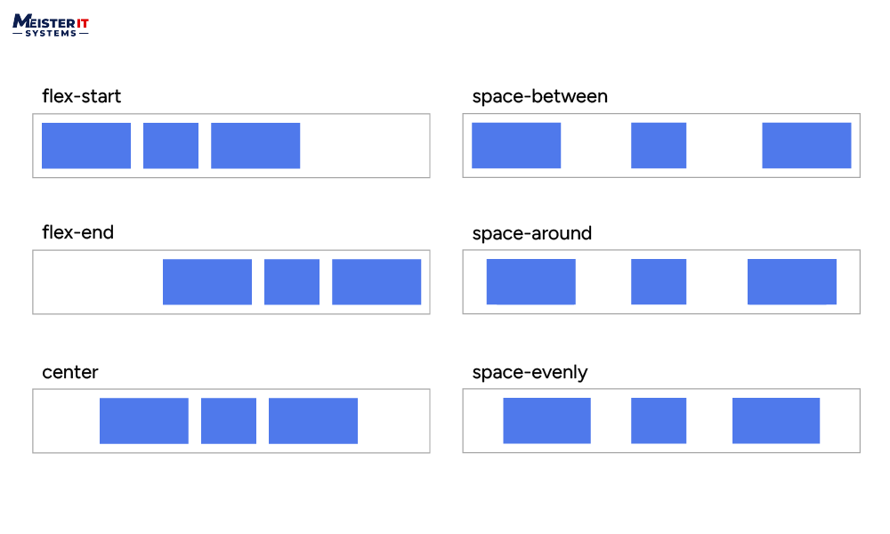

## QUESTION-1
Flexbox (Flexible Box Layout) is a modern CSS layout system designed to arrange items in a container, even when their size is unknown or dynamic. It makes it easier to build flexible and responsive layouts by allowing items to grow, shrink, and align properly inside a container.

Flexbox is considered better than traditional float or inline-block layouts because:

It makes alignment (both horizontal and vertical) much easier.

It avoids the common float issues like clearing and collapsing.

Items can automatically adjust their size to fill space.

The layout is more responsive and adapts well to different screen sizes.

It requires less CSS code and no hacks or clearfixes.

Overall, Flexbox simplifies layout creation and is widely used in modern web design for building clean, responsive, and flexible interfaces.

 Question 2 -> Using alignment in flexbox

Flexbox provides several properties to control alignment and spacing, with align-items and justify-content being fundamental for centering elements. We use the "align-items" property to align the item on the cross axis, which in this case is the block axis running vertically. We use "justify-content" to align the item on the main axis, which in this case is the inline axis running horizontally.

So, let's look the properties for controlling alignment in flexbox : 

* justify-content: Controls the alignment of all items on the main axis.
* align-items: Controls the alignment of all items on the cross axis.

### Justify-content (main axis) properties:

With justify-content we control what happens with available space, should there be more space than is needed to display the items. In our initial example with display: flex on the container, the items display as a row and all line up at the start of the container. This is due to the initial value of justify-content being normal, which behaves as start. Any available space is placed at the end of the items.

The baseline values aren't relevant in this dimension. Otherwise, the justify-content property accepts the same values as align-content.

* justify-content: flex-start
* justify-content: flex-end
* justify-content: start
* justify-content: end
* justify-content: left
* justify-content: right
* justify-content: center
* justify-content: space-between
* justify-content: space-around
* justify-content: space-evenly
* justify-content: stretch (behaves as start)
* justify-content: normal (behaves as stretch, which behaves as start)

### Align-items (cross axis) properties:

The align-items property, set on the flex container, and the align-self property, set on flex items, control the alignment of flex items on the cross axis. The cross axis runs down the columns if flex-direction is row and along the rows if flex-direction is column. 

* align-items: stretch
* align-items: flex-start
* align-items: flex-end
* align-items: start
* align-items: end
* align-items: center
* align-items: baseline
* align-items: first baseline
* align-items: last baseline

## QUESTION-3
In Flexbox, the main axis is the primary direction in which flex items are arranged within a container, while the cross axis is perpendicular to the main axis. The flex-direction property determines the direction of the main axis. Here's a breakdown: Main Axis: This is the direction in which flex items are placed. By default, it's a horizontal row (left to right). However, you can change it to a column (top to bottom) using flex-direction: column. Cross Axis: This axis is always perpendicular to the main axis. If the main axis is a row, the cross axis is a column, and vice versa.

# Question 4 -> Flex Container vs Flex Items

Let's start difference betwen these -> flex container and flex items. What is exactyl flex container and what is flex items ? 

* Flex Container: The parent element with display: flex or display: inline-flex. It controls the layout of its children using flexbox rules.
* Flex Items: The direct children (child elements) inside the flex container. These are the elements that are arranged according to flexbox properties.

Flex containers and flex items have different properties and values. Let's look at them :

## Flex Container

3 of them and their explanations :

* Flex-direction : 

It has row, column, row-reverse and column-reverse values. The flex-direction CSS property sets how flex items are placed in the flex container defining the main axis and the direction -> it can be change normal or reversend depending on the value.

* Justify-content : 

The justify-content property in CSS is used to align flex items or grid items within their container along the main axis (horizontal for flex-direction: row, vertical for flex-direction: column). It controls how extra space is distributed between and around the items.  We wrote it's values on the top.

* Align-items : 

The CSS align-items property is used to align flex items along the cross axis within a flex container. It essentially controls how the flex items are positioned vertically (when the flex direction is row) or horizontally (when the flex direction is column). We wrote it's values on the top.

## Flex Items

3 of them and their explanations :

* Order : 

It takes an integer value. It allows we to control the visual order of flex items within a flex container, overriding their default source order in the HTML

* Flex-grow : 

It takes a number value. Flex-grow is a CSS property that determines how much a flex item will grow relative to other flex items within the same flex container when there's extra space available

* Align-self :

The align-self property in CSS is used to align the selected items in the flexible container in many different manners such as flex-end, center, flex-start, etc

## QUESTION-5
The flex property in CSS is a shorthand that sets how a flex item behaves in a flex container. It combines three properties into one line: flex-grow, flex-shrink, and flex-basis.

The syntax is:

flex: <flex-grow> <flex-shrink> <flex-basis>;

flex-grow controls how much the item will grow if there is extra space.

flex-shrink controls how much the item will shrink if there is not enough space.

flex-basis sets the initial size of the item before any growing or shrinking happens.

Examples:

flex: 1 means flex-grow is 1, flex-shrink is 1, and flex-basis is 0%. The item will grow and shrink as needed, starting from 0 size.

flex: 0 means no growing, can shrink, and starts at 0 size.

flex: auto means the item can grow and shrink and starts from its natural size.

flex: none means no growing or shrinking and uses the item’s natural size.

flex: 2 1 100px means the item grows twice as fast as others, can shrink, and starts at 100 pixels width.

If you write only one number like flex: 2, the browser treats it as flex: 2 1 0%.

# Question 6 -> Flexbox Page

Designing a page layout with Flexbox in mind involves thinking of the page as a collection of flexible containers and elements. First, we divide the page into logical sections (like the header, main content area, and footer) and set these sections as flex containers by applying display: flex . Within each container, the child elements become flex elements, whose arrangement we control using properties like flex-direction to choose whether the elements flow in rows or columns. Flexbox lets us easily manage spacing and alignment with properties like justify-content and align-items , making it easy to evenly distribute or center elements along the main and cross axes. We can also control how much each element grows or shrinks relative to its siblings using the flex property, which allows our layout to seamlessly adapt to different screen sizes. To increase responsiveness, media queries are used to set flex-direction or wrapping behavior, allowing elements to stack or resize appropriately on smaller devices. Flexbox also lets us override the alignment for individual elements with align-self , providing fine-grained control over the layout. In general, designing with Flexbox means embracing flexibility, responsiveness, and clean alignment, resulting in user-friendly and visually balanced web pages.
